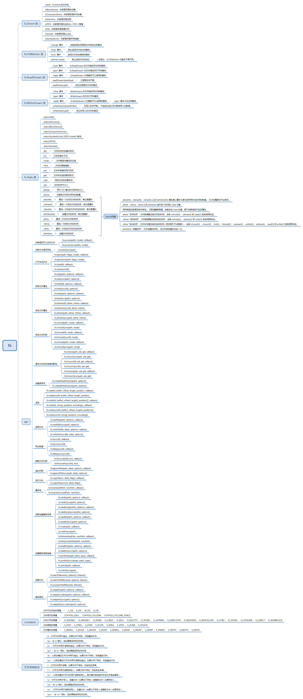

## nodejs —— fs
### 概览
fs 模块提供了一个 API，用于以接近标准 POSIX 函数的方式与文件系统进行交互。所有文件系统操作都具有同步和异步的形式。

异步的形式始终将完成回调作为其最后一个参数。 传递给完成回调的参数取决于具体方法，但第一个参数始终保留用于异常。 如果操作成功完成，则第一个参数将为 null 或 undefined。使用异步方法时无法保证顺序

使用同步操作发生的异常会立即抛出，可以使用 try/catch 处理，也可以允许冒泡。

### nodejs读写文件的三种方式
#### 一、readFile和writeFile
1、readFile方法是将要读取的文件内容完整读入缓存区，再从该缓存区中读取文件内容，具体操作如下：
<pre><code>fs.readFile('./test.txt', 'utf8', function(err, data){
  console.log(data); 
}); </code></pre>
与其对应的同步方法为：
<pre><code>var data = fs.readFileSync('./test.txt', 'utf8');
console.log(data);
</code></pre>
同步方法和异步方法的区别是：在使用同步方法执行的操作结束之前，不能执行后续代码的执行；而异步方法将操作结果作为回调函数的参数进行返回，方法调用之后，就可以立即执行后续的代码，读取完毕后会调用对应的回调函数。

2、writeFile方法是将要写入的文件内容完整的读入缓存区，然后一次性的将缓存区中的内容写入都文件中，其同步和异步具体操作如下：
<pre><code>fs.writeFile('./message.txt', '这是第一行',function(err){
  if(err) console.log('写文件操作失败');
  else console.log('写文件操作成功');
});</code></pre>
与其对应的同步方法为：
<pre><code>fs.writeFileSync('./message.txt','这是第一行');</code></pre>

以上的读写操作，Node.js将文件内容视为一个整体，为其分配缓存区并且一次性将文件内容读取到缓存区中，在这个期间，Node.js将不能执行任何其他处理。所以当读写大文件的时候，有可能造成缓存区“爆仓”。

#### 二、read和write
1、read或readSync方法读取文件内容是不断地将文件中的一小块内容读入缓存区，最后从该缓存区中读取文件内容，具体操作如下：
<pre><code>var fs = require('fs');
fs.open('./message.txt','r',function(err,fd){
  var buf = new Buffer(225);
  //读取fd文件内容到buf缓存区
  fs.read(fd,buf,0,9,3,function(err,bytesRead,buffer){
    console.log(buf.slice(0,bytesRead).toString());
  }); 
  var buff = new Buffer(225);
  //位置设置为null会默认从文件当前位置读取
  fs.read(fd,buff,0,3,null,function(err,bytesRead,buffer){
    console.log(buff.slice(0,bytesRead).toString());
  });
 
  var buffer = new Buffer(225);
  //同步方法读取文件
  var bytesRead = fs.readFileSync(fd,buffer,0,9,3);
  console.log(bytesRead);
  console.log(buffer.slice(0,bytesRead).toString());
});</code></pre>
2、write或writeSync方法写入内容时，node.js执行以下过程：1将需要写入的数据写入到一个内存缓存区；2待缓存区写满后再将缓存区中的内容写入到文件中；3重复执行步骤1和步骤2，知道数据全部写入文件为止。具体操作如下：
<pre><code>var fs = require('fs');
var buf = new Buffer('我喜爱编程');
fs.open('./mess.txt','w',function(err,fd){
  fs.write(fd,buf,3,9,0,function(err,written,buffer){
    fs.write(fd,buf,12,3,null,function(err,written,buffer){
      if(err) console.log('写文件操作失败');
      console.log('写文件操作成功');
    });
  });
  //同步写入
  fs.writeSync(fd,buf,3,9,0);
});</code></pre>
以上读写操作，node.js会将文件分成一块一块逐步操作，在读写文件过程中允许执行其他操作。

但有的时候我们并不关心整个文件的内容，而只关注从文件中读取到的某些数据，以及读取到数据时需要执行的处理，这时我们可以使用文件流来处理。

#### 三、createReadStream和createWriteStream
1、createReadStream方法创建一个将文件内容读取为流数据的ReadStream对象，方法如下所示：
<pre><code>var fs = require('fs');
var readStream = fs.createReadStream('./message.txt',{start:3,end:12});
readStream.on('open',function(fd){
  console.log('开始读取文件');
});
readStream.on('data',function(data){
  console.log('读取到数据：');
  console.log(data);
});
readStream.on('end',function(){
  console.log('文件已全部读取完毕');
});
readStream.on('close',function(){
  console.log('文件被关闭');
});
readStream.on('error',function(err){
  console.log('读取文件失败');
});</code></pre>
2、createWriteStream方法创建一个将流数据写入文件中的WriteStream对象，方法如下所示：
<pre><code>var fs = require('fs');
var file = fs.createReadStream('./message.txt');
var out = fs.createWriteStream('./anotherMessage.txt');
file.on('data',function(data){
  out.write(data);
});
out.on('open',function(fd){
  console.log('需要被写入的文件已打开');
});
file.on('end',function(){
  //将操作系统缓存区中的数据全部写入文件
  out.end('再见',function(){
    console.log('文件全部写入完毕');
    console.log('共写入'+out.bytesWritten+'数据');
  });
});</code></pre>

### 同步内核缓冲区
**缓冲区简单介绍：** 在调用函数write()时，我们觉得该函数一旦返回，数据便已经写到了文件里。但实际上，操作系统实现某些文件I/O时（如磁盘文件）。为了保证I/O的效率，在内核一般会用到一片专门的区域（内存或独立的I/O地址空间）作为I/O数据缓冲区。它用在输入输出设备和CPU之间，用来缓存数据，使得低速的设备和快速的CPU可以协调工作避免低速的输入输出设备长时间占用CPU。降低系统调用，提高了CPU的工作效率。

当将数据写入文件时，内核通常先将该数据拷贝到当中一个缓冲区。假设该缓冲区尚未写满。则并不将其排入输出队列，而是等待其写满或者当内核须要重用该缓冲区以便存放其它磁盘块数据时，再将该缓冲区排入输出队列；然后待其到达队首时。才进行实际的I/O操作。这样的输出方式被称为延迟写。

延迟写降低了磁盘读写次数，可是却降低了文件内容的更新速度，使得欲写到文件里数据在一段时间内并没有写到磁盘上。当系统发生问题时，这样的延迟可能造成文件更新内容的丢失。

同步内核缓冲区一共有三种方法： sync、fsync和fdatasync函数，nodejs没有提供第一种方法。

#### 1、sync[void sync(void)]
sync负责将系统缓冲区的数据“写入”磁盘。以确保数据的一致性和同步性。注意：sync函数仅仅是将全部改动过的块缓冲区排入写队列，然后就返回。他并不等待实际I/O操作结束。所以不要觉得调用了sync函数，就觉得数据已安全的送到磁盘文件上，有可能会出现故障，可是sync函数是无法得知的。
系统守候进程一般每隔一段时间调用一次sync函数，确保定期刷新内核的块缓存。

UNIX系统中，系统守候进程update会周期性地（一般每一个30秒）调用sync函数。命令sync(1)也调用sync函数。

#### 2、fsync [int fsync(int filedes)]
与sync函数不同，fsync函数仅仅对由文件描符filedes指定的单一文件起作用，强制与描写叙述字fildes相连文件的全部改动过的数据（包含核内I/O缓冲区中的数据）传送到外部永久介质。即刷新fildes给出的文件的全部信息。而且等待写磁盘操作结束，然后返回。调用 fsync()的进程将堵塞直到设备报告传送已经完毕。这个fsync就安全点了。

一个程序在写出数据之后。假设继续进行兴许处理之前要求确保所写数据已写到磁盘，则应当调用fsync()。比如，数据库应用一般会在调用write()保存关键交易数据的同一时候也调用fsync()。这样更能保证数据的安全可靠。

#### 3、fdatasync [int fsync(int filedes)]
fdatasync函数类似于fsync函数，但它仅仅影响文件数据部分。强制传送用户已写出的数据至物理存储设备。不包含文件本身的特征数据。这样能够适当降低文件刷新时的数据传送量。而除数据外，fdatasync还会同步更新文件的属性。

fsync和fdatasync若成功则返回0。若出错则返回-1，同一时候设置errno以指明错误。
错误代码：
+ EBADF：文件描写叙述符无效。或文件已关闭。
+ EIO：读写的过程中错误发生。
+ EROFS，EINVAL：文件所在的文件系统不支持同步。

#### 异步write
传统的UNIX或LINUX系统在设计时使用了内核缓冲区，设有快速缓冲区或页面快速缓冲区，大多数磁盘I/O都通过缓冲区进行。当调用write()函数写出数据时，数据一旦写到该缓冲区，函数便马上返回。此时写出的数据能够用read()读回，也能够被其它进程读到，可是并不意味着它们已经被写到了外部永久存储介质上。即使调用close()关闭文件后也可能如此。 由于缓冲区的数据可能还在等待输出。

因此，从数据被实际写到磁盘的角度来看。用write()写出的文件数据与外部存储设备并非全然同步的。不同步的时间间隔非常短，一般仅仅有几秒或十几秒，详细取决于写出的数据量和I/O数据缓冲区的状态。虽然不同步的时间间隔非常短，可是假设在此期间发生掉电或者系统崩溃，则会导致所写数据来不及写至磁盘而丢失的情况。

内核将缓冲区中的数据“写”到标准输入磁盘文件里，这里“写”不是将缓冲区中的数据移动到磁盘文件里，而是复制到磁盘文件里，也就说此时磁盘文件里还保留一份缓冲区内容的备份。做出这一设计也是有其道理的。假设写出到磁盘文件上，磁盘坏了或满了等等，总之就是无法将数据送出，假如没备份。那数据不是丢掉了。也就是说内核会等待写入磁盘动作完毕后，才放心的将备份的数据删除掉。

### 文件别名（文件共享）- 硬链接与软链接
文件共享是指不同的用户使用不同的文件名来使用同一文件。在用一般共享目录结构时，一用户增加文件的内容，只改变自己的文件目录，其它用户不知改变。
+ 基于索引节点(index node)的共享方式（硬链接） 
> 实现文件共享的一种有效方法是基本文件目录法。该方法把所有目录的内容分为文件名和文件说明两部分。一部分称为符号文件目录（SDF），它包含文件符号名和由系统赋予唯一的内部标识符ID组成。另一部分称为基本文件目录（BDF），它包含目录项中除文件符号名外的所有其它信息，并加上与符号目录相一致的内部标识符ID。标识符ID是各文件在基本文件目录中表目的排序号。UNIX/Linux采用了基本文件目录法目录结构。  
采用文件名和文件说明分离的目录结构有利于实现文件共享，这里的文件共享是指不同的用户对同一文件可取不同的文件名，即给文件取别名。文件共享是通过在二个不同子目录下取了不同的文件名，但它们具有相同的索引节点号的方法来实现，UNIX/Linux这种目录结构称为树形带勾连的目录结构。 
文件硬连接不利于文件主删除它拥有的文件，因为文件主要删除它拥有的共享文件，必须首先删除（关闭）所有的硬连接，否则就会造成共享该文件的用户的目录表目指针悬空。

+ 利用符号连接(symbolic link, shortcut) （软链接）
> 系统为共享的用户创建一个link类型的新文件，将这新文件登录在该用户共享目录项中，这个link型文件包含连接文件的路径名。该类文件在用ls命令长列表显示时，文件类型为l。当用户要访问共享文件且正要读link型新文件时，操作系统根据link文件类型性质将文件读出的内容作为路径名去访问真正的共享文件。在UNIX中也是使用ln来建立符号连接的共享文件。  
采用符号连接可以跨越文件系统，甚至可以通过计算机网络连接到世界上任何地方的机器中的文件，此时只需提供该文件所在的地址，以及在该机器中的文件路径。 
符号连接的缺点：其它用户读取符号连接的共享文件比读取硬连接的共享文件需要增多读盘操作。因为其它用户去读符号连接的共享文件时，系统中根据给定的文件路径名，逐个分量地去查找目录，通过多次读盘操作才能找到该文件的索引节点，而用硬连接的共享文件的目录文件表目中已包括了共享文件的索引节点号。

#### 硬链接特性
+ 文件有相同的 inode 及 data block；
+ 只能对已存在的文件进行创建；
+ 不能交叉文件系统进行硬链接的创建；
+ 不能对目录进行创建，只可对文件创建；
+ 删除一个硬链接文件并不影响其他有相同 inode 号的文件。

#### 软链接特性
+ 软链接有自己的文件属性及权限等；
+ 可对不存在的文件或目录创建软链接；
+ 软链接可交叉文件系统；
+ 软链接可对文件或目录创建；
+ 创建软链接时，链接计数 i_nlink 不会增加；
+ 删除软链接并不影响被指向的文件，但若被指向的原文件被删除，则相关软连接被称为死链接（即dangling link，若被指向路径文件被重新创建，死链接可恢复为正常的软链接）。

### 监听文件修改
nodejs提供了两种监听文件修改的方式：fs.watch和fs.watchFile
#### fs.watch
每个操作系统都有自己的文件更改事件被触发。在Linux上，它是inotify，在macOS 系统上，对文件使用 kqueue，对目录使用 FSEvents，在Windows上是ReadDirectoryChangesW。fs.watch结合所有这些不同类型的事件系统提供了一种通知文件系统更改的方法，该方法具有以下几个特性：
+ 一个更可靠的实现使得文件改变的事件能够总是被执行
+ 一个更快的实现，当事件发生时能够立即通知到Node进程

此特性取决于底层操作系统，如果底层功能由于某些原因不可用，则 fs.watch 将无法运行。 例如，当使用虚拟化软件（如 Vagrant、Docker 等）时，在网络文件系统（NFS、SMB 等）或主文件系统上监视文件或目录可能是不可靠的，在某些情况下也是不可能的。
#### fs.watchFile
watchFile采用轮询的方式定时调用fs.stat来检查文件的状态，轮询的时间间隔可以通过参数设置。该方法具有跨平台的特点，但该方法较慢且不太可靠。，不能在文件修改后立即触发，并且相对来说会占用更多的资源，而且该方法只能对文件进行监控，对文件夹无效。
总结：根据官方文档，应该优先考虑使用fs.watch方法，该方法更可靠，在fs.watch由于某些原因不能使用时可考虑使用fs.watchFile。

#### 两者的缺点
fs.watch
+ 不会再OSX上显示文件名
+ 当你在OSX用编辑器编辑文件的时候不会触发事件
+ 经常会连续触发两次事件
+ 没有提供一个好的接口去递归文件
+ 等等

fs.watchFile
+ 经常在处理事件的时候会挂掉
+ 没法递归文件
+ 过高的CPU占用率

#### 较为成熟的解决方案
使用chokidar
<pre><code>npm install chokidar --save</code></pre>

### 参数——文件路径和文件描述符
当要操作文件时，需要通过参数指定要操作的文件，该参数可能是文件的路径(字符串、Buffer、或使用 file: 协议的 URL 对象)，也可能是文件描述符。

+ 字符串形式的路径会被解释为表示绝对或相对文件名的 UTF-8 字符序列。相对路径将相对于 process.cwd() 指定的当前工作目录进行解析。
+ 使用 Buffer 指定的路径主要用于将文件路径视为不透明字节序列的某些 POSIX 操作系统。 在这样的系统上，单个文件路径可以包含使用多种字符编码的子序列。 与字符串路径一样，Buffer 路径可以是相对路径或绝对路径
+ 对于大多数 fs 模块的函数，path 或 filename 参数可以是 WHATWG URL 对象。 仅支持使用 file: 协议的 URL 对象。URL 始终是绝对路径。使用 URL 对象可能会引入特定于平台的行为。 
在 Windows 上，带有主机名的 URL 转换为 UNC 路径，而带有驱动器号的 URL 转换为本地绝对路径。没有主机名和驱动器号的 URL 将导致抛出错误。带有驱动器号的 URL 必须使用 : 作为驱动器号后面的分隔符。使用其他分隔符将导致抛出错误。在所有其他平台上，不支持带有主机名的 URL，使用时将导致抛出错误。 
包含编码后的斜杆字符（%2F）的 URL 在所有平台都将导致抛出错误。在 Windows 上，包含编码后的反斜杆字符（%5C）的 URL 将导致抛出错误。
+ 文件描述符: 
在 POSIX 系统上，对于每个进程，内核都维护一个当前打开的文件和资源的表格。 为每个打开的文件分配一个称为文件描述符的简单数字标识符。 在系统级，所有文件系统操作都使用这些文件描述符来标识和跟踪每个特定文件。 Windows 系统使用不同但概念上类似的机制来跟踪资源。 为了简化用户的工作，Node.js 抽象出操作系统之间的特定差异，并为所有打开的文件分配一个数字文件描述符。 
fs.open() 方法用于分配新的文件描述符。一旦被分配，文件描述符可用于从文件读取数据，向文件写入数据、或请求关于文件的信息。 
**注意事项：** 
1、任何指定的文件描述符都必须支持读取。 
2、如果将文件描述符指定为 path，则不会自动关闭。 
3、读数将从当前位置开始。例如，如果文件已经具有内容 'Hello World' 并且使用文件描述符读取了六个字节，则使用相同文件描述符调用 fs.readFile() 将返回 'World' 而不是 'Hello World'。

#### 什么时候选择文件描述符作为操作文件的参数
一般而言操作文件都需要先打开文件，生成文件描述符，然后再使用文件描述符来操作文件，操作完成后需要及时关闭文件，以释放占用的资源。这种直接对文件的操作属于底层操作，除了使用底层api，nodejs还提供了一些直接操作文件的api，使用这些api操作文件时不需要先open文件获取文件描述符，也不要要在操作完成后close文件（这些api也支持使用文件描述符来操作文件，当使用文件操作符时，文件不会自动关闭）。
底层操作api有：
+ open(此时还没有文件描述符，参数仍未文件路径)
+ read 和 readSync
+ write 和 writeSync
+ close 和 closeSync
+ fstat 和 fstatSync
+ fsync 和 fsyncSync
+ fdatasync 和 fdatasyncSync
+ ftruncate 和 ftruncateSync
+ fchmod 和 fchmodSync
+ fchown 和 fchownSync
+ futimes 和 futimesSync

可以看出，除了打开、读、写、关闭外，其他直接操作文件的api都是"f"开头，当然也可以看出一些以"l"开头的api只支持使用文件路径作为参数，不支持使用文件描述符作为参数，但是也有一些不是"l"开头的api也只支持使用文件路径作为参数。

以上底层api再使用时只能使用文件描述符作为操作文件的参数。如果你需要对文件进行多种操作，那么也可以在使用同时支持两种风格的api中使用文件描述符，在所有的操作完成后再关闭文件。对于只支持文件路径的api，只能选择文件路径，而不能选择文件描述符作为参数。

### 文件属性
nodejs提供了3组api获取文件属性，分别是：
+ fs.stat(path[, options], callback) 和 fs.statSync(path[, options])
+ fs.fstat(fd[, options], callback) 和 fs.fstatSync(fd[, options])
+ fs.lstat(path[, options], callback) 和 fs.lstatSync(path[, options])

正常情况下会返回一个 fs.Stats 对象，该对象中包含了文件所有属性和一些方法

#### fs.Stats 类
属性：
+ dev 包含该文件的设备的数字标识符
+ ino 文件系统特定的文件索引节点编号。
+ mode 描述文件类型和模式的位字段。
+ nlink 文件存在的硬链接数。
+ uid 拥有该文件的用户的数字用户标识符（POSIX）。
+ gid 拥有该文件的组的数字组标识符（POSIX）。
+ rdev 如果文件被视为特殊文件，则该值为数字设备标识符。
+ size 文件的大小（以字节为单位）。
+ blksize 用于 I/O 操作的文件系统块大小。
+ blocks 为此文件分配的块数。
+ atimeMs 表示上次访问此文件的时间戳，以 POSIX Epoch 以来的毫秒数表示。
+ mtimeMs 表示上次修改此文件的时间戳，以 POSIX Epoch 以来的毫秒数表示。
+ ctimeMs 表示上次更改文件状态的时间戳，以 POSIX Epoch 以来的毫秒数表示。
+ birthtimeMs 表示此文件创建时间的时间戳，以 POSIX Epoch 以来的毫秒数表示。
+ atime 表示上次访问此文件的时间戳。
+ mtime 表示上次修改此文件的时间戳。
+ ctime 表示上次更改文件状态的时间戳。
+ birthtime 表示此文件创建时间的时间戳。

方法：
+ isBlockDevice() 如果 fs.Stats 对象描述块设备，则返回 true。
+ isCharacterDevice() 如果 fs.Stats 对象描述字符设备，则返回 true。
+ isDirectory() 如果 fs.Stats 对象描述文件系统目录，则返回 true。
+ isFIFO() 如果 fs.Stats 对象描述先进先出（FIFO）管道，则返回 true。
+ isFile() 如果 fs.Stats 对象描述常规文件，则返回 true。
+ isSocket() 如果 fs.Stats 对象描述套接字，则返回 true。
+ isSymbolicLink() 如果 fs.Stats 对象描述符号链接，则返回 true。

#### 文件类型
| 类型 | 说明 |
| ------ | ------ |
| fs.constants.S_IFMT | 用于提取文件类型代码的位掩码。 |
| fs.constants.S_IFREG | 表示常规文件。 |
| fs.constants.S_IFDIR | 表示目录。 |
| fs.constants.S_IFCHR | 表示面向字符的设备文件。 |
| fs.constants.S_IFBLK | 表示面向块的设备文件。 |
| fs.constants.S_IFIFO | 表示 FIFO 或管道。 |
| fs.constants.S_IFLNK | 表示符号链接。 |
| fs.constants.S_IFSOCK | 表示套接字。 |

#### 文件模式
| 模式 | 说明 |
| ------ | ------ |
| fs.constants.S_IRWXU | 表明所有者可读、可写、可执行。 |
| fs.constants.S_IRUSR | 表明所有者可读。 |
| fs.constants.S_IWUSR | 表明所有者可写。 |
| fs.constants.S_IXUSR | 表明所有者可执行。 |
| fs.constants.S_IRWXG | 表明群组可读、可写、可执行。 |
| fs.constants.S_IRGRP | 表明群组可读。 |
| fs.constants.S_IWGRP | 表明群组可写。 |
| fs.constants.S_IXGRP | 表明群组可执行。 |
| fs.constants.S_IRWXO | 表明其他人可读、可写、可执行。 |
| fs.constants.S_IROTH | 表明其他人可读。 |
| fs.constants.S_IWOTH | 表明其他人可写。 |
| fs.constants.S_IXOTH | 表明其他人可执行。 |

#### 文件属性的时间值
atimeMs、mtimeMs、ctimeMs 以及 birthtimeMs 属性是是保存相应时间（以毫秒为单位）的数字。 它们的精确度取决于平台。 atime、mtime、ctime 以及 birthtime 是对应时间的 Date 对象。 Date 值和数字值没有关联性。 对数字值重新赋值、或者改变 Date 值，都不会影响到对应的属性。

stat 对象中的时间具有以下语义：
+ atime "访问时间" - 上次访问文件数据的时间。由 mknod(2)、 utimes(2) 和 read(2) 系统调用更改。
+ mtime "修改时间" - 上次修改文件数据的时间。由 mknod(2)、 utimes(2) 和 write(2) 系统调用更改。
+ ctime "变化时间" - 上次更改文件状态的时间（修改索引节点数据）。由 chmod(2)、 chown(2)、 link(2)、 mknod(2)、 rename(2)、 unlink(2)、 utimes(2)、 read(2) 和 write(2) 系统调用更改。
+ birthtime "创建时间" - 文件创建的时间。 创建文件时设置一次。 在不支持创建时间的文件系统上，该字段可能被替代为 ctime 或 1970-01-01T00:00Z（如 Unix 纪元时间戳 0）。 在这种情况下，该值可能大于 atime 或 mtime。 在 Darwin 和其他的 FreeBSD 衍生系统上，如果使用 utimes(2) 系统调用将 atime 显式地设置为比 birthtime 更早的值，也会有这种情况。

#### 修改文件系统时间戳
nodejs提供了两组方法直接设置文件访问时间和修改时间
<pre><code>fs.futimes(fd, atime, mtime, callback) 和 fs.futimesSync(fd, atime, mtime)
fs.utimes(path, atime, mtime, callback) 和 fs.utimesSync(path, atime, mtime)</code></pre>
**atime 和 mtime 参数遵循以下规则：**
+ 值可以是表示 Unix 纪元时间的数字、Date 对象、或类似 '123456789.0' 的数值字符串。Unix 纪元时间的数字要使用秒数而不是毫秒数
+ 如果该值无法转换为数值、或值为 NaN、Infinity 或 -Infinity，则抛出错误。

以上两个方法可以同时修改对应属性的两种格式的属性值

### 更改文件权限
nodejs提供了三组更改文件权限的api，主要区别在于指定文件时使用的参数，注意当使用文件描述符作为参数时，文件不会自动关闭。其中path和fd用来指定文件，mode指文件模式，回调函数除了可能的异常，没有其他参数。
+ fs.chmod(path, mode, callback) 和 fs.chmodSync(path, mode)
+ fs.fchmod(fd, mode, callback) 和 fs.fchmodSync(fd, mode)
+ fs.lchmod(path, mode, callback) 和 fs.lchmodSync(path, mode)

#### 文件的模式——mode
方法中使用的 mode 参数是使用以下常量的逻辑或运算创建的数字型位掩码：
| 常量 | 八进制值 | 说明 |
| ------ | ------ | ------ |
| fs.constants.S_IRUSR | 0o400 | 所有者可读 |
| fs.constants.S_IWUSR | 0o200 | 所有者可写 |
| fs.constants.S_IXUSR | 0o100 | 所有者可执行或搜索 |
| fs.constants.S_IRGRP | 0o40 | 群组可读 |
| fs.constants.S_IWGRP | 0o20 | 群组可写 |
| fs.constants.S_IXGRP | 0o10 | 群组可执行或搜索 |
| fs.constants.S_IROTH | 0o4 | 其他人可读 |
| fs.constants.S_IWOTH | 0o2 | 其他人可写 |
| fs.constants.S_IXOTH | 0o1 | 其他人可执行或搜索 |

构造 mode 更简单的方法是使用三个八进制数字的序列（ 例如 765）。 最左边的数字（示例中的 7）指定文件所有者的权限。 中间的数字（示例中的 6）指定群组的权限。 最右边的数字（示例中的 5）指定其他人的权限
| 数字 | 说明 |
| ------ | ------ |
| 7 | 可读、可写、可执行 |
| 6 | 可读、可写 |
| 5 | 可读、可执行 |
| 4 | 只读 |
| 3 | 可写、可执行 |
| 2 | 只写 |
| 1 | 只可执行 |
| 0 | 没有权限 |

**注意事项：** 在 Windows 上，只能更改写入权限，并且不会实现群组、所有者或其他人的权限之间的区别。fs.chmod的第一个参数如果是一个符号链接时，操作会作用到符号链接的目标文件而不是符号本身，fs.lchmod不解析符号链接。

### 更改文件的所有者和群组
nodejs提供了三组更改文件的所有者和群组的api，主要区别在于指定文件时使用的参数，注意当使用文件描述符作为参数时，文件不会自动关闭。其中path和fd用来指定文件，uid, gid分别指用户ID和群组ID，回调函数除了可能的异常，没有其他参数。
+ fs.chown(path, uid, gid, callback) 和 fs.chownSync(path, uid, gid)
+ fs.fchown(fd, uid, gid, callback) 和 fs.fchownSync(fd, uid, gid)
+ fs.lchown(path, uid, gid, callback) 和 fs.lchownSync(path, uid, gid)

注意：如果fs.chown的第一个参数是一个符号链接，则会接触符号链接。fs.lchown不解析符号链接。