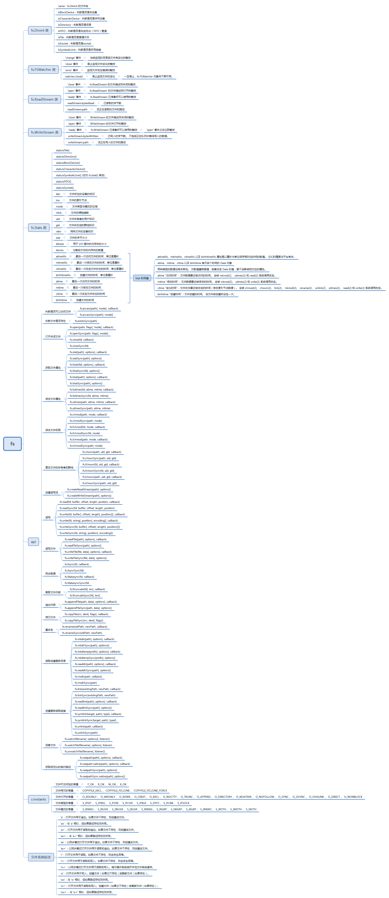

## nodejs —— fs
### 概览
fs 模块提供了一个 API，用于以接近标准 POSIX 函数的方式与文件系统进行交互。所有文件系统操作都具有同步和异步的形式。

异步的形式始终将完成回调作为其最后一个参数。 传递给完成回调的参数取决于具体方法，但第一个参数始终保留用于异常。 如果操作成功完成，则第一个参数将为 null 或 undefined。使用异步方法时无法保证顺序

使用同步操作发生的异常会立即抛出，可以使用 try/catch 处理，也可以允许冒泡。

### nodejs读写文件的三种方式
#### 一、readFile和writeFile
1、readFile方法是将要读取的文件内容完整读入缓存区，再从该缓存区中读取文件内容，具体操作如下：
<pre><code>fs.readFile('./test.txt', 'utf8', function(err, data){
  console.log(data); 
});	</code></pre>
与其对应的同步方法为：
<pre><code>var data = fs.readFileSync('./test.txt', 'utf8');
console.log(data);
</code></pre>
同步方法和异步方法的区别是：在使用同步方法执行的操作结束之前，不能执行后续代码的执行；而异步方法将操作结果作为回调函数的参数进行返回，方法调用之后，就可以立即执行后续的代码，读取完毕后会调用对应的回调函数。

2、writeFile方法是将要写入的文件内容完整的读入缓存区，然后一次性的将缓存区中的内容写入都文件中，其同步和异步具体操作如下：
<pre><code>fs.writeFile('./message.txt', '这是第一行',function(err){
  if(err) console.log('写文件操作失败');
  else console.log('写文件操作成功');
});</code></pre>
与其对应的同步方法为：
<pre><code>fs.writeFileSync('./message.txt','这是第一行');</code></pre>

以上的读写操作，Node.js将文件内容视为一个整体，为其分配缓存区并且一次性将文件内容读取到缓存区中，在这个期间，Node.js将不能执行任何其他处理。所以当读写大文件的时候，有可能造成缓存区“爆仓”。

#### 二、read和write
1、read或readSync方法读取文件内容是不断地将文件中的一小块内容读入缓存区，最后从该缓存区中读取文件内容，具体操作如下：
<pre><code>var fs = require('fs');
fs.open('./message.txt','r',function(err,fd){
  var buf = new Buffer(225);
  //读取fd文件内容到buf缓存区
  fs.read(fd,buf,0,9,3,function(err,bytesRead,buffer){
    console.log(buf.slice(0,bytesRead).toString());
  }); 
  var buff = new Buffer(225);
  //位置设置为null会默认从文件当前位置读取
  fs.read(fd,buff,0,3,null,function(err,bytesRead,buffer){
    console.log(buff.slice(0,bytesRead).toString());
  });
 
  var buffer = new Buffer(225);
  //同步方法读取文件
  var bytesRead = fs.readFileSync(fd,buffer,0,9,3);
  console.log(bytesRead);
  console.log(buffer.slice(0,bytesRead).toString());
});</code></pre>
2、write或writeSync方法写入内容时，node.js执行以下过程：1将需要写入的数据写入到一个内存缓存区；2待缓存区写满后再将缓存区中的内容写入到文件中；3重复执行步骤1和步骤2，知道数据全部写入文件为止。具体操作如下：
<pre><code>var fs = require('fs');
var buf = new Buffer('我喜爱编程');
fs.open('./mess.txt','w',function(err,fd){
  fs.write(fd,buf,3,9,0,function(err,written,buffer){
    fs.write(fd,buf,12,3,null,function(err,written,buffer){
      if(err) console.log('写文件操作失败');
      console.log('写文件操作成功');
    });
  });
  //同步写入
  fs.writeSync(fd,buf,3,9,0);
});</code></pre>
以上读写操作，node.js会将文件分成一块一块逐步操作，在读写文件过程中允许执行其他操作。

但有的时候我们并不关心整个文件的内容，而只关注从文件中读取到的某些数据，以及读取到数据时需要执行的处理，这时我们可以使用文件流来处理。

#### 三、createReadStream和createWriteStream
1、createReadStream方法创建一个将文件内容读取为流数据的ReadStream对象，方法如下所示：
<pre><code>var fs = require('fs');
var readStream = fs.createReadStream('./message.txt',{start:3,end:12});
readStream.on('open',function(fd){
  console.log('开始读取文件');
});
readStream.on('data',function(data){
  console.log('读取到数据：');
  console.log(data);
});
readStream.on('end',function(){
  console.log('文件已全部读取完毕');
});
readStream.on('close',function(){
  console.log('文件被关闭');
});
readStream.on('error',function(err){
  console.log('读取文件失败');
});</code></pre>
2、createWriteStream方法创建一个将流数据写入文件中的WriteStream对象，方法如下所示：
<pre><code>var fs = require('fs');
var file = fs.createReadStream('./message.txt');
var out = fs.createWriteStream('./anotherMessage.txt');
file.on('data',function(data){
  out.write(data);
});
out.on('open',function(fd){
  console.log('需要被写入的文件已打开');
});
file.on('end',function(){
  //将操作系统缓存区中的数据全部写入文件
  out.end('再见',function(){
    console.log('文件全部写入完毕');
    console.log('共写入'+out.bytesWritten+'数据');
  });
});</code></pre>