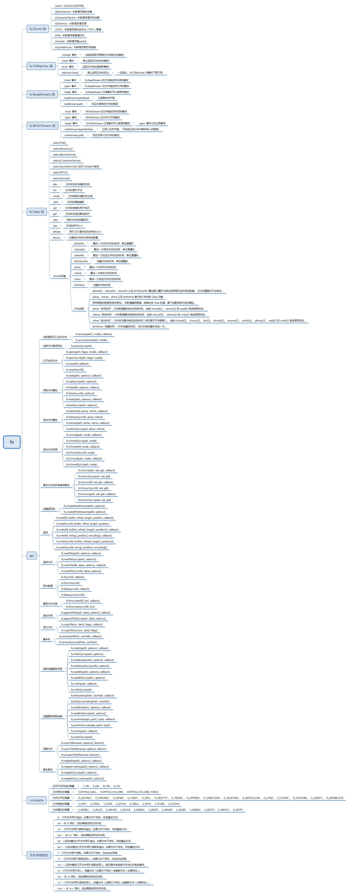

## nodejs —— fs
### 概览
fs 模块提供了一个 API，用于以接近标准 POSIX 函数的方式与文件系统进行交互。所有文件系统操作都具有同步和异步的形式。

异步的形式始终将完成回调作为其最后一个参数。 传递给完成回调的参数取决于具体方法，但第一个参数始终保留用于异常。 如果操作成功完成，则第一个参数将为 null 或 undefined。使用异步方法时无法保证顺序

使用同步操作发生的异常会立即抛出，可以使用 try/catch 处理，也可以允许冒泡。

